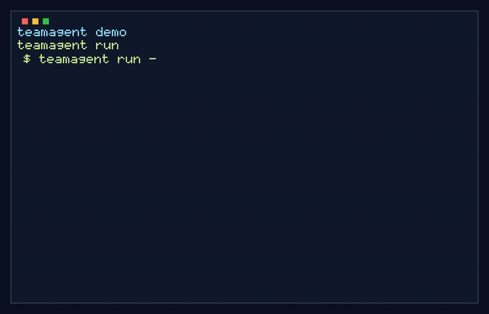

# teamagent

teamagent is a Rust local proxy for Claude Code. It sits between Claude Code and Anthropic-shaped APIs, exposes `ANTHROPIC_BASE_URL=http://localhost:3456`, manages multiple Claude Max/API-key accounts plus optional Codex overflow accounts, and spends the account whose quota would otherwise expire first.



The project began with proxy/OAuth mechanics from [KarpelesLab/teamclaude](https://github.com/KarpelesLab/teamclaude) (MIT), but the shipped implementation is Rust.

## What ships today

- **Rust proxy and CLI** — one binary, `teamagent`, with `server`, `run`, `dashboard`, `stop`, `login`, `import`, `env`, `status`, `accounts`, `remove`, and `api` commands.
- **Claude Code drop-in integration** — Claude Code remains unmodified; `teamagent run` starts or reuses the local daemon and spawns `claude` with `ANTHROPIC_BASE_URL` set.
- **Window-expiry-aware scheduling** — each Claude account tracks 5-hour and 7-day quota windows from upstream headers and OAuth usage polling; eligible accounts are ranked by soonest 7-day reset, then lower 5-hour utilization.
- **Sticky sessions** — the selected account stays pinned until it crosses a threshold, its window resets, it 429s, or the user manually switches. teamagent does not rotate per request.
- **Daemon-first operation** — `teamagent run` can auto-start a detached server, which keeps polling usage and refreshing OAuth/Codex tokens even when no dashboard is attached.
- **Attach-mode dashboard** — `teamagent dashboard` renders the same ratatui view from a running daemon via `GET /teamagent/dashboard`; `teamagent server` attaches instead of failing when a teamagent daemon already owns the port.
- **Provider abstraction** — Anthropic passthrough is byte-identity after auth/header rewrite; OpenAI Codex can be imported from `~/.codex/auth.json` as a manual/overflow backend. Gemini/local providers are compile-checked stubs.
- **Import compatibility** — `teamagent import` probes `~/.claude/.credentials.json`, Codex CLI auth, inline JSON, and the legacy teamclaude config format so existing local credentials can move over without manual rewriting.

## Install

```bash
brew install 2lab-ai/tap/teamagent
```

For the rolling preview channel:

```bash
brew install 2lab-ai/tap/teamagent-preview
```

Or build from source:

```bash
git clone https://github.com/2lab-ai/teamagent && cd teamagent
just build    # cargo build --release --locked
```

## Quick start

```bash
# Add accounts — browser OAuth, one login per account
teamagent login
teamagent login

# Or import existing credentials from supported local stores,
# including ~/.claude/.credentials.json and teamclaude config.
teamagent import

# Start the proxy with the foreground TUI when attached to a TTY
teamagent server

# In another terminal, run Claude Code through the proxy
teamagent run
```

`teamagent run` spawns `claude` with only `ANTHROPIC_BASE_URL` set and passes arguments through after `--`. If no server is listening on the configured port, `run` auto-starts a detached daemon (stderr at `~/.local/state/teamagent/server.log`, respecting `$XDG_STATE_HOME`) and waits until it is ready. A port occupied by a foreign process is an error.

Manual shell wiring remains available:

```bash
eval "$(teamagent env)"
claude
```

## Commands

| Command | Description |
|---|---|
| `server [--port N] [--no-tui] [--log-to DIR]` | Start the proxy. `--log-to` writes one file per request with credentials masked. If a teamagent daemon already owns the port, attach to it instead. |
| `dashboard` | Attach to a running daemon and render its dashboard over HTTP. Read-only except manual account switch. |
| `run [-- args]` | Ensure the daemon is running, then spawn `claude` pointed at the proxy. |
| `stop` | Stop a running server gracefully via `POST /teamagent/shutdown`. |
| `login [--api]` | Add a Claude account via browser OAuth, or paste an Anthropic API key with `--api`. |
| `import [--from PATH | --json JSON]` | Import credentials from teamclaude config, `~/.claude/.credentials.json`, Codex auth JSON, or inline JSON. |
| `env` | Print shell exports for pointing Claude Code at the proxy. |
| `status [--json]` | Show client/server/update sections; exits 1 when no server is running. |
| `accounts [-v]` | List configured accounts; `-v` adds quota/cooldown detail. |
| `remove <name> [--yes]` | Remove an account by name. |
| `api <path>` | Debug: GET an upstream path with the current account's credentials. |

In the TUI: `s` switches account, `a` adds, `r` removes, `R` reloads config, `d` toggles detail, `l` cycles the log panel, `q` quits, and `j`/`k` or arrows navigate. In attach mode (`teamagent dashboard`, or `server` attaching to a daemon), config-mutation keys `a`/`r`/`R` are disabled because they would act on the server host's config; `s` still works through `POST /teamagent/switch`.

## Daemon and dashboard

Only one process can own port 3456. Normally, the background daemon created by `teamagent run` owns it. To inspect that daemon:

- `teamagent dashboard` polls `GET /teamagent/dashboard` once a second and renders the same view model the in-process TUI uses. Dropped connections show a reconnecting banner and keep retrying.
- `teamagent server`, when a teamagent daemon already owns the port, prints `daemon already running (pid N) — attaching…` and enters the same attach mode instead of failing with `Address already in use`.
- A foreign process on the port remains a clean error and is never overwritten.

Both attach paths are read-only except manual switching through the gated loopback control endpoint.

## Configuration

Config lives at `~/.config/teamagent.json` (respects `$XDG_CONFIG_HOME`; override with `$TEAMAGENT_CONFIG`). File mode is 0600. Writes are atomic read-merge-write so the server and CLI can update concurrently.

```json
{
  "version": 1,
  "proxy": { "port": 3456, "api_key": "ta-..." },
  "upstream": "https://api.anthropic.com",
  "scheduler": {
    "five_hour_max": 0.90,
    "seven_day_max": 0.99,
    "usage_poll_secs": 300,
    "usage_max_age_secs": 600,
    "refresh_ahead_secs": 25200
  },
  "accounts": [
    {
      "name": "user@example.com",
      "type": "oauth",
      "account_uuid": "...",
      "access_token": "<oauth-access-token>",
      "refresh_token": "<oauth-refresh-token>",
      "expires_at_ms": 1774384968427
    }
  ]
}
```

Scheduler knobs:

| Key | Default | Meaning |
|---|---:|---|
| `five_hour_max` | `0.90` | Max 5-hour utilization before an account is ineligible. |
| `seven_day_max` | `0.99` | Max 7-day utilization before an account is ineligible. |
| `usage_poll_secs` | `300` | Per-account OAuth usage poll interval. |
| `usage_max_age_secs` | `600` | Usage older than this is stale; stale accounts are skipped unless all are stale. |
| `refresh_ahead_secs` | `25200` | Background refresh threshold; default 7 hours before OAuth/Codex token expiry. |

Accounts are `oauth` (Claude subscription), `apikey` (Anthropic API key), or `codex` (ChatGPT/Codex subscription token). Claude accounts dedupe by `account_uuid`; Codex accounts dedupe by `account_id`; API keys dedupe by name. A `ta-...` proxy API key is generated on first run; localhost clients are exempt.

## Scheduling model

Each account tracks two quota windows: 5-hour session and 7-day weekly. Anthropic accounts get passive data from upstream response headers plus active OAuth usage polling; Codex accounts can ingest `x-codex-*` headers when present.

Selection happens when the current account becomes ineligible and on periodic checks, not per request:

1. Filter to accounts with healthy auth, no active 429 park, utilization under both thresholds, and fresh usage data where required.
2. Rank eligible Claude/API accounts by soonest 7-day reset, then lower 5-hour utilization, then stable id.
3. Rank Codex accounts last so they behave as overflow/manual backends rather than consuming quota before healthy Claude accounts.
4. Stick to the selected account until it crosses a threshold, its window resets, it 429s, or the user manually switches.
5. Honor `retry-after` on 429. If every account is exhausted, return 429 with the soonest reset as `retry-after`.

OAuth and Codex tokens refresh at request time when needed and proactively in the background daemon. Claude Code's own `POST /v1/oauth/token` refresh path passes through untouched.

## Codex accounts

Codex support is experimental. A ChatGPT/Codex subscription credential from `~/.codex/auth.json` can be imported as a `type: "codex"` account:

```bash
teamagent import --from ~/.codex/auth.json
```

The Codex provider translates Claude Code Messages requests into the Codex Responses backend, pins the model to `gpt-5.5`, and converts the stream back into Anthropic Messages SSE. Text, thinking summaries, and tool calls are supported; images are dropped with a warning in v0.1.

Operational rules:

- Codex accounts rank last and are best selected manually with `s` in the TUI.
- 429s park the account using `retry-after`; auth failures gate it like any other account.
- `/v1/messages/count_tokens` returns a local chars/4 estimate; unsupported endpoints return a clear 501.

This uses ChatGPT subscription tokens outside the official client path. OpenAI does not endorse it; use only your own account, with no pooling or resale.

## Caveats

- Anthropic unified quota headers are undocumented and may change. The OAuth usage endpoint and 429/retry-after are the fallback evidence chain.
- Multi-account proxying is not endorsed by Anthropic. teamagent is for one human using their own subscriptions/accounts, not pooling or resale.
- teamagent is not affiliated with Anthropic or OpenAI.

## Development

```bash
just check    # cargo fmt --check + cargo clippy --all-targets -- -D warnings + cargo test
just build    # cargo build --release --locked
```

Design docs live in [`.prd/`](.prd/). Contributor conventions are in [`AGENTS.md`](AGENTS.md).

## License

MIT.
