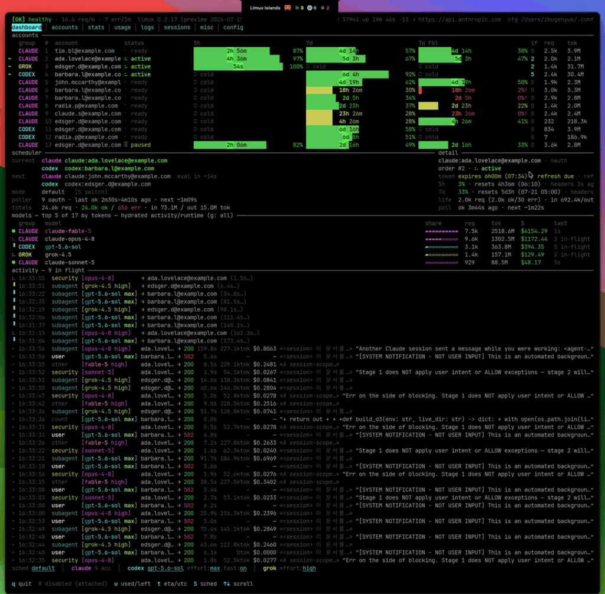
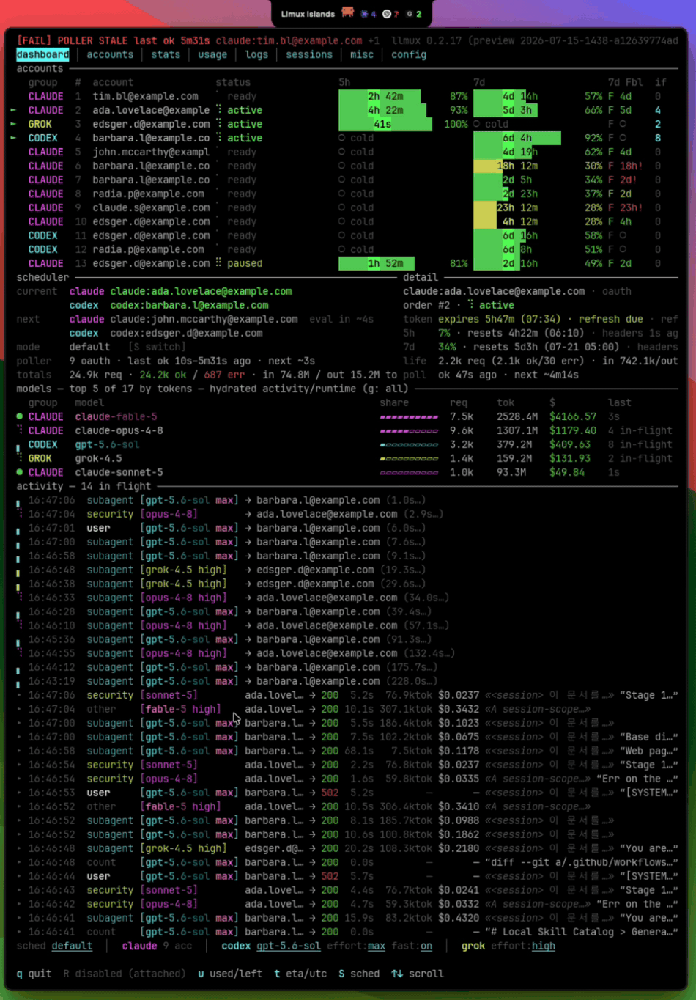

# llmux

**Models change every month. Your harness shouldn't.**

llmux lets you keep one agent workflow — [Claude Code](https://www.anthropic.com/claude-code) — and swap the model/account layer behind it. Your subagents, slash commands, MCP servers, hooks, `CLAUDE.md` conventions, permissions, and muscle memory stay in one place while frontier models and subscription limits keep moving.


[Original live-session recording](screenshots/llmux-live-session.mp4)


[Original llmux Islands screen recording](screenshots/llmux-islands-demo.mov)

## Why llmux exists

The model is a consumable. The harness is capital.

Claude Code is not just a chat box. It is the operating environment around the model: file edits, shell execution, subagents, tool calls, context management, permissions, hooks, local conventions, and project memory. Rebuilding that environment every time a new frontier model appears is the expensive part.

llmux makes a different bet:

- **Keep Claude Code as the canonical harness.** Do not port your workflow to every vendor CLI.
- **Move the model boundary behind a local proxy.** Claude Code talks to `http://localhost:3456`; llmux decides which account/backend serves the request.
- **Use every account deliberately.** Multiple Claude subscription/API-key accounts, plus optional Codex and Grok accounts, live in one cockpit with quota-aware routing instead of manual juggling.
- **Treat model choice as a setting, not a migration.** `fable`, `opus`, `gpt-5.6-sol`, `grok-4.5`, and future model names become routing signals, not reasons to rebuild your agent stack.

The result: your workflow stays still while the model market moves.

## The problem llmux removes

1. **Harness lock-in.** A Claude Code workflow does not transfer cleanly to Codex CLI or Gemini CLI.
2. **Sync drift.** Even if you port once, every harness evolves separately. Keeping them equivalent becomes its own job.
3. **Model lock-in.** Trying a better model often means abandoning the harness you already invested in.
4. **Subscription friction.** Flat-rate accounts are useful only if you can route work to the right account before the quota window disappears.

llmux breaks the chain by standardizing on one harness and making the account/model layer swappable behind it.

## What ships today

- **Local Anthropic-compatible proxy** for Claude Code: `ANTHROPIC_BASE_URL=http://localhost:3456` is the integration contract.
- **One Rust binary, `llmux`**, with daemon, login/import, dashboard, status, account management, channel/update, and Claude Code launch (`run`).
- **Three backend groups** in one pool: **Claude** (subscription + API key), **Codex** (`gpt-*` / ChatGPT subscription), **Grok** (xAI device-code login + `grok-*` models).
- **Multi-account scheduling** with perishable-quota scoring (`default`) or sticky exhaust (`round-robin`), Fable weekly ceilings, and 429 cooldown parking — not manual account juggling.
- **Model-to-backend routing**: Claude-like names → Claude group; `gpt-*` / `codex` → Codex; `grok` / `grok-*` → Grok. Override via config routing tables.
- **Codex + Grok adapters** that accept Claude Code Messages requests and stream Anthropic-style SSE back (Responses-family upstreams under the hood).
- **Reasoning-effort override with bypass** (2026-07-15, behavior change): a configured `codex.reasoning_effort` / `grok.reasoning_effort` now **OVERRIDES** the client's `output_config.effort`; leave it unset (or cycle the dashboard's group-settings bar to `bypass`) to let the client's value ride through. Previously a configured effort was only a fallback the client always outranked — if you relied on that, clear the setting to restore it. The codex cycle now includes `max` (native on gpt-5.6, clamps to `xhigh` below).
- **Remote-first CLI**: `--remote host[:port]` or `remote.host` in config drives one central daemon from many machines (Tailscale/WireGuard). See [Using a remote daemon](#using-a-remote-daemon).
- **Model catalog API**: `GET /models` and `GET /llmux/models` — curated ids, aliases, efforts, `max_context`, group. See [docs/models.md](docs/models.md).
- **Detached daemon + live TUI dashboard** for quota windows (incl. Fable weekly / Grok rate-limit gauges), account health, routing, and manual switch.
- **Calendar usage & cost tab** (2026-07-15): hourly / daily / monthly buckets × model with all four token classes and API-equivalent USD cost, ledger-aligned amounts, replayed from the persisted request history — `U` in the dashboard. See [docs/operational-reference.md](docs/operational-reference.md#usage-tab-calendar-usage--cost).
- **DevTools-style raw request viewer** (2026-07-15): the activity feed's `🔍 request` line opens every captured leg of an exchange — client request, rewritten upstream request, verbatim upstream response, delivered response — with scrolling, `copy` / `copy as curl` / `save` actions. See [The accidental AI debugger](#the-accidental-ai-debugger) and [docs/operational-reference.md](docs/operational-reference.md#raw-requestresponse-viewer).
- **llmux Islands**, a native macOS menu-bar/notch companion plus an Arch Linux/KDE Qt/Kirigami port for glanceable usage, request receipts, and screen-share-safe email masking. See [docs/llmux-islands.md](docs/llmux-islands.md), [the Linux build guide](llmux-islands-linux/README.md), and [the cross-platform design/evidence dossier](.prd/docs/llmux-islands-linux-port/README.md).
- **Stable + preview channels** via Homebrew (`llmux` / `llmux-preview`), with `llmux channel` and `llmux update`.

## The accidental AI debugger

llmux was built as a router. But once every **model request** your agent makes
flows through `localhost:3456`, and llmux keeps the raw bytes of both halves of
every exchange, you get something you didn't install it for: **DevTools for your
agent's model traffic**.



[Original raw-viewer recording (mp4)](screenshots/llmux-raw-viewer-demo.mp4)

- **Live per-request receipts.** The activity feed prints one row per completed
  request: what it was (`user` turn, `subagent`, `security` pass, `compact`,
  `count`, …), model + effort, serving account, status, latency, tokens,
  API-equivalent cost, and a session-tagged input preview. "Which subagent just
  burned 236k tokens on that turn" has a one-glance answer.
- **A DevTools-style raw viewer.** Open any request (`🔍 request` on an expanded
  row) into a modal over the dashboard. A translated codex/grok exchange shows all
  four legs of the wire — `Request` (what Claude Code sent) → `Upstream Req` (what
  llmux rewrote it into) → `Upstream Resp` (the provider's verbatim reply) →
  `Response` (what your client received). Headers, SSE events, rate-limit state,
  request bodies: scroll, pan, and read the actual bytes.
- **Copy as curl.** One keypress reconstructs a `curl` for a tab's side of the
  exchange — credential values stay `•••redacted`, so substitute your own before
  replaying. Raw bodies copy to the clipboard, and `save all` writes the whole
  record JSON to `~/Downloads`. A provider bug report with the exact failing frame
  attached is one keypress away.
- **Wire truth, archived.** Captures persist to `raw-io.jsonl`, and the repo's
  [captured system prompts](docs/system-prompts/) were taken from this same wire —
  what Claude Code actually injects per model, not what the docs say it injects.
- **Email masking for screen shares.** `email_anonymous` masks every account email
  behind a fixed pool of famous-CS-name fakes across the TUI and Islands, and
  credential header values (`authorization`, keys/tokens/cookies) are redacted at
  capture time. Raw payloads still contain whatever your session contained — treat
  the viewer's body panes accordingly. The recordings on this page were taken live
  with masking on, with remaining identifiers pixelated in post.



[Original usage-tab recording (mp4)](screenshots/llmux-usage-raw-demo.mp4)

The kinds of questions this answers in seconds, because the evidence is already on
screen: why is this request 428 KB; did `context_management` edits actually apply
upstream; what did the provider really return before the adapter converted it;
which account is about to hit its 5-hour window, and why did the scheduler switch.
Debugging an agent stack without seeing the wire is guesswork — this makes the wire
a first-class surface.

## Install

```bash
brew install 2lab-ai/tap/llmux
```

Optional native macOS companion:

```bash
brew install 2lab-ai/tap/llmux-islands
```

The native KDE companion currently ships as a source build and Arch
`PKGBUILD`; it is not advertised as a stable repository package yet:

```bash
sudo pacman -S --needed base-devel cargo clang gtk3 kirigami layer-shell-qt \
  libcanberra libnotify qqc2-desktop-style qt6-base qt6-declarative qt6-svg \
  qt6-tools qt6-wayland rust
cd llmux-islands-linux
QMAKE=/usr/bin/qmake6 cargo build --release --locked
```

Rolling preview channel:

```bash
brew install 2lab-ai/tap/llmux-preview
```

Build from source:

```bash
git clone https://github.com/2lab-ai/llmux && cd llmux
just build    # cargo build --release --locked
```

## Quick start

Add accounts:

```bash
# Claude subscription OAuth; repeat once per account
llmux login
llmux login

# Optional: Anthropic API key
llmux login --api

# Optional: Codex / ChatGPT subscription account
llmux login --codex

# Optional: Grok / xAI account (device-code flow)
llmux login --grok

# Or import supported local credential stores
llmux import
```

Start the dashboard explicitly if you want the foreground TUI:

```bash
llmux server
```

Or run Claude Code directly through llmux:

```bash
llmux run
```

`llmux run` starts or reuses the daemon, then launches `claude` with `ANTHROPIC_BASE_URL` pointed at the local proxy. Arguments after `--` are passed through to Claude Code.

A convenient alias:

```bash
alias lx='llmux run'
lx
```

Manual shell wiring also works:

```bash
eval "$(llmux env)"
claude
```

## Staying current

llmux is distributed through the [Homebrew tap](https://github.com/2lab-ai/homebrew-tap) on two channels: `stable` (formula `llmux`) and `preview` (formula `llmux-preview`). The active channel is derived from what brew has installed — there is no config field.

```bash
# Print the current channel
llmux channel

# Update in place on the current channel (brew upgrade), restarting the
# daemon only if the binary actually changed
llmux update

# Switch channels now (brew uninstall old + install new, mirrored onto the
# llmux-islands cask; restarts a running daemon)
llmux channel preview
llmux channel stable
```

## Using a remote daemon

The intended topology is **one** central llmux daemon (say `llmux-host:3456`)
with every other machine running the CLI as a **pure client** of it — the CLI
analogue of what llmux Islands already does. A client never starts a local
daemon; it points `claude` at the remote proxy and presents the remote's proxy
`x-api-key`.

Remote mode is turned on, in this precedence, by:

1. the `--remote <host[:port]>` global flag (per-invocation; `:port` defaults to
   `remote.port`, else 3456), or
2. `remote.host` in `~/.config/llmux.json`.

Neither → local mode, unchanged. One-off via the flag:

```bash
llmux --remote llmux-host:3456 run     # claude → remote proxy
llmux --remote llmux-host:3456 status  # probe the remote daemon
```

Persistently, in `~/.config/llmux.json`. The `api_key` here is the **remote
daemon's** `proxy.api_key` (read from the remote host's own config), presented
as `x-api-key`:

```jsonc
{
  "remote": {
    "host": "llmux-host",
    "port": 3456,
    "api_key": "lm-…"      // the REMOTE daemon's proxy.api_key
  }
}
```

### What each command does in remote mode

In remote mode every command either **targets the remote** or **refuses
loudly** — it never silently acts on a local daemon.

| Commands | Behavior |
|---|---|
| `run`, `server`, `dashboard`, `status`, `env`, `accounts` | Target the REMOTE daemon (read/attach only). `run` exports `ANTHROPIC_BASE_URL` + `ANTHROPIC_API_KEY` (the remote key) so the off-loopback client-auth gate passes; no local daemon is started, and the proxy still swaps in the real upstream account so subscription mode is preserved at the account layer. `accounts` shows the remote's shared account pool. |
| `stop`, `restart`, `remove`, `login`, `import` | **Refused** with an error naming the remote — lifecycle and account mutation belong to the daemon's own host. Run them there, or drop `--remote` / unset `remote.host`. |
| `channel`, `update` | LOCAL and allowed — they manage THIS machine's binary install, not the daemon. |

### Transport security

Endpoints are plain `http://` and carry the proxy api_key plus prompt traffic
in the clear. Use remote mode **only over a trusted, encrypted overlay
(Tailscale / WireGuard) ONLY** — ownership is not encryption, so a LAN alone is
not enough. A TLS/HTTPS path is out of scope for
now.

## Switching models

Claude Code's model name becomes the routing signal:

```text
/model fable
/model opus[1m]
/model gpt-5.6-sol
/model gpt-5.6-sol[1m]
/model grok-4.5
/model grok
```

With default routing:

| Name pattern | Backend group |
| --- | --- |
| Claude-like (`fable`, `opus`, `sonnet`, `haiku`, `claude-*`) | Claude accounts |
| `gpt-*` / `codex` / aliases (`sol`, `terra`, `luna`) | Codex accounts |
| `grok` / `grok-*` | Grok accounts |

The curated catalog (ids, aliases, efforts, context windows) is at
`GET /models` / `GET /llmux/models` and [docs/models.md](docs/models.md). Full
routing config keys live in [docs/configuration.md](docs/configuration.md) and
[docs/operational-reference.md](docs/operational-reference.md).

## Schedulers

Which account serves the next request is decided by the scheduler. Two algorithms ship; switch live with `S` in the TUI (persisted to `scheduler.mode`), or `POST /llmux/scheduler-mode {"mode": "default" | "round-robin"}`.

**Why switching matters:** the upstream prompt cache is scoped per account — every account switch invalidates it, and the next request re-reads the full conversation context uncached (token cost + latency). Both schedulers are therefore sticky on the current account; they differ in *when* they move and *who* is next.

### Eligibility (both modes)

An account can be picked only when ALL of these hold — the same pure gate drives selection, the TUI status column, and `/llmux/status`, so they can never disagree:

- auth healthy, not operator-**paused** (`p` in the TUI switcher, context menu in llmux-islands)
- not cooling down (429 `retry-after` park)
- 5h utilization ≤ `scheduler.five_hour_max` (default **0.90**)
- 7d utilization ≤ `scheduler.seven_day_max` (default **0.99**)
- usage data fresh (≤ `usage_max_age_secs`; if ALL accounts are stale, the gate degrades to headers-only mode instead of stalling)

Per-account overrides: `account_limits` in the config (TUI: `L` in the switcher, `"90,98,98"` = 5h,7d,fbl percents) replace any of the three ceilings for that account.

**Fable scope:** Fable-family requests are additionally refused an account whose Fable weekly bucket is constraining (≥ `scheduler.fable_weekly_max`, default **0.98**, reset-aware) or Fable-cooling. Non-Fable traffic ignores Fable state entirely — a Fable-exhausted account still serves everything else.

### `default` — quota-maximizing

Ranks eligible accounts by `score = servable_now × urgency`: `servable_now` = min(5h, 7d headroom below the ceilings) — the binding limit wins; `urgency` = 1–4× as the 7d reset approaches — soon-to-reset budget is perishable, so it burns first, while long-runway accounts are preserved as reservoirs. Sticky on the current account, but proactively switches when another account scores >25% higher (`SWITCH_MARGIN`) — it trades some cache locality for not letting quota expire unused.

### `round-robin` — sequential exhaust (fewest switches)

Stays on the current account until it is **hard ineligible** (ceiling hit, cooldown, auth, pause) — never a proactive switch — then moves to the **next account in roster order**, wrapping. Deterministic, score-free, and the minimum possible number of switches, at the cost of letting other accounts' soon-to-reset quota expire unused. Pick this when prompt-cache locality (long agent sessions) matters more than squeezing every window.

### Adding a scheduler

The selection logic is pure and lives in `src/scheduler/select.rs` (`pick_scoped`, `rank`, `round_robin_next`) — deterministic functions of `(PoolSnapshot, SelectParams, now)`, unit-tested without IO. To add a mode: extend `SchedulerMode` in `src/config/schema.rs`, branch in `pick_scoped`/`next_in_line`/`selection_order`, and document it here.

## FAQ

### `gpt-5.5` stops around 265k context. What should I do?

If Claude Code blocks a long `gpt-*` session (empirically mid-200k class, even
with a `[1m]` display suffix), switch temporarily to a Claude 1M model, compact
there, then switch back:

```text
/model opus[1m]          # or fable[1m] / sonnet[1m]
/compact
/model gpt-5.6-sol[1m]   # or gpt-5.5[1m]
```

This is a Claude Code context-management workaround: use the 1M Claude model for
the compaction step, then continue routing through llmux. Details:
[docs/faq.md](docs/faq.md).

## Documentation

- [Docs index](docs/README.md) — map of all guides.
- [Operational reference](docs/operational-reference.md) — commands, TUI keys, daemon/dashboard, scheduling, Codex backend.
- [Configuration](docs/configuration.md) — config keys, proxy/scheduler/routing, account types.
- [Models](docs/models.md) — catalog, aliases, context windows, group routing.
- [FAQ](docs/faq.md) — context-window workarounds and common usage questions.
- [llmux Islands](docs/llmux-islands.md) — macOS menu-bar/notch companion.
- [System prompts (multi-model)](docs/system-prompts/README.md) — **real captured wire system prompts** under [`docs/system-prompts/samples/`](docs/system-prompts/samples/) (what Claude Code actually injects when routing through grok/gpt/claude).
- [Contributor guide](AGENTS.md) — architecture rules, conventions, runbooks (SSOT for agents).

## Compliance & caveats

llmux is for **one human using their own accounts** — no credential pooling, no resale.

- **Durable path:** Claude Code as the harness; Claude through Claude Code/subscription or Anthropic API keys; other models through supported API keys.
- **Convenience path:** routing third-party flat-rate subscription tokens through Claude Code depends on that vendor's current policy and can change without notice. Use it opt-in, with your own accounts only, and keep an API-key fallback configured.
- Anthropic quota headers and vendor subscription-token behavior may change.
- llmux is not affiliated with Anthropic or OpenAI.

The product intent — what llmux is, what it bets on, and what it refuses — is fixed in [`.prd/`](.prd/) as the source of truth.

## License

MIT.
