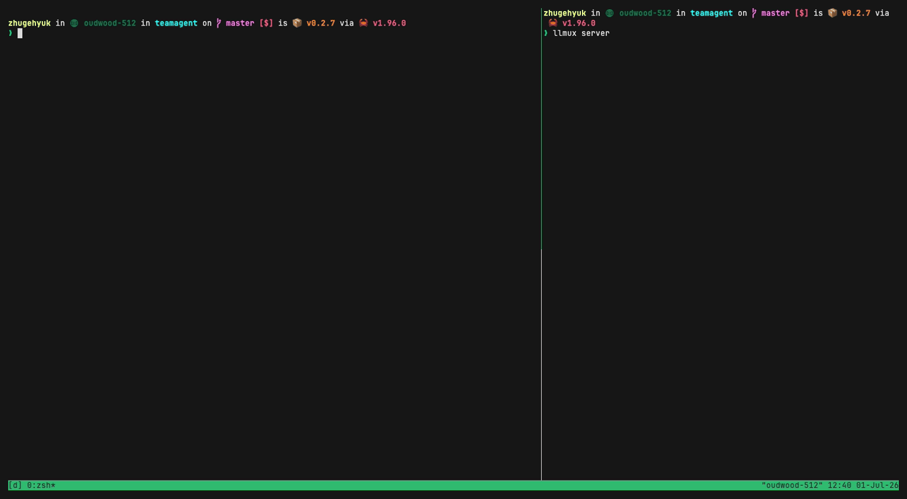

# llmux

**Models change. Your harness should not.**

llmux keeps [Claude Code](https://www.anthropic.com/claude-code) as the agent
harness you already know and moves model selection, account selection, quota
tracking, and provider translation behind one local proxy. Your tools,
subagents, hooks, permissions, project memory, and muscle memory stay put while
the model and account serving each request can change.

## The idea

The model is consumable; the harness is capital.

Claude Code is more than a chat client. It is the operating environment around
the model: repository rules, tool calls, context management, MCP servers,
slash commands, and local automation. Rebuilding that environment for every
provider is the expensive part. llmux makes the model boundary swappable
instead:

- Claude Code talks to one Anthropic-compatible endpoint.
- The request's model name selects a Claude, Codex, or Grok account group.
- A quota-aware scheduler selects a healthy account inside that group.
- The daemon translates non-Anthropic traffic and returns Anthropic-shaped
  streaming responses to Claude Code.
- The terminal dashboard and llmux Islands observe and control that same
  daemon; neither owns credentials independently.


[Open the full-size architecture view](docs/assets/architecture-overview.html)
or read [How llmux works](docs/concepts.md).

## What ships

| Layer | Shipped surface |
| --- | --- |
| Traffic | Anthropic-compatible proxy normally reached at `127.0.0.1:3456`; non-loopback access is API-key-gated and intended for trusted encrypted overlays. |
| Accounts | Claude subscription OAuth, Anthropic API keys, ChatGPT/Codex subscription OAuth, and xAI/Grok device-code OAuth. |
| Routing | Claude-like names → Claude, `gpt-*`/Codex aliases → Codex, `grok*` → Grok. Each group keeps its own sticky account. |
| Scheduling | Perishable-quota scoring, sequential exhaust mode, 5h/7d/Fable ceilings, 429 cooldowns, pauses, and per-account limits. |
| Operations | One Rust `llmux` binary with daemon lifecycle, login/import, live TUI, status, account management, channel switching, and self-update. |
| Native UI | llmux Islands for macOS and a native Qt/Kirigami shell for Arch Linux/KDE, both backed by the shared Rust semantic core. |

## Platform support

| Product | macOS | Linux |
| --- | --- | --- |
| `llmux` CLI/daemon | Homebrew stable/preview; release binaries for Apple Silicon and Intel | Release binaries for x86_64 and aarch64; source build on other Rust targets |
| llmux Islands | Homebrew cask stable/preview | Arch/KDE `PKGBUILD` from this repository |

The Linux Islands package is currently **not** published to pacman, the AUR,
or an xbrew recipe. Consequently `xbrew install llmux-islands` and
`xbrew install llmux-islands-preview` cannot work on Arch yet. Install its
repository `PKGBUILD` as shown below.

## Install

### macOS

```bash
brew install 2lab-ai/tap/llmux

# Optional native companion
brew install 2lab-ai/tap/llmux-islands
```

Use `llmux-preview` and `llmux-islands-preview` instead for the rolling preview
channel.

### Linux CLI

Download the binary for `x86_64` or `aarch64` from the
[latest GitHub release](https://github.com/2lab-ai/llmux/releases/latest),
verify it against `SHA256SUMS`, and install it as `llmux`. Exact copy-paste
commands are in [Getting started](docs/getting-started.md#linux).

### Arch Linux/KDE companion

```bash
sudo pacman -S --needed base-devel git
git clone --depth=1 https://github.com/2lab-ai/llmux.git
cd llmux/llmux-islands-linux/packaging/arch
CARGO_BUILD_JOBS=2 MAKEFLAGS=-j2 makepkg -si
llmux-islands-linux
```

The two job limits keep the local package build from consuming every CPU core.
For dependencies, desktop behavior, source builds, and troubleshooting, see
[llmux Islands](docs/llmux-islands.md#arch-linux-kde) and the
[Linux component guide](llmux-islands-linux/README.md).

## Five-minute start

Add at least one account:

```bash
llmux login          # Claude subscription OAuth

# Optional additional account types
llmux login --api    # Anthropic API key
llmux login --codex  # ChatGPT/Codex subscription
llmux login --grok   # xAI/Grok device-code flow
```

Then launch Claude Code through llmux:

```bash
llmux run
```

`llmux run` starts or reuses the daemon and launches `claude` with
`ANTHROPIC_BASE_URL` pointed at llmux. Use `llmux server` for a foreground TUI,
`llmux dashboard` to attach to an existing daemon, and `llmux status` for a
quick health check.

Inside Claude Code, the model name becomes a routing signal:

| Example | Backend group |
| --- | --- |
| `/model fable`, `/model opus[1m]` | Claude |
| `/model gpt-5.6-sol`, `/model terra` | Codex |
| `/model grok`, `/model grok-4.5` | Grok |

See the [model catalog](docs/models.md) for current IDs and the
[configuration reference](docs/configuration.md) for overrides.

## See it



The native UI guide includes real, CI-produced
[macOS and KDE screenshots](docs/llmux-islands.md#visual-tour), including
request and settings receipts.

## Read next

- [Documentation map](docs/README.md) — choose a path by task or audience.
- [Getting started](docs/getting-started.md) — install, first account, first
  request, and verification.
- [How llmux works](docs/concepts.md) — the product mental model.
- [Architecture](docs/architecture.md) — runtime components and data flows.
- [Operational reference](docs/operational-reference.md) — commands, TUI keys,
  daemon lifecycle, activity, and APIs.
- [Configuration](docs/configuration.md) — every durable behavior knob.
- [llmux Islands](docs/llmux-islands.md) — macOS and Arch/KDE installation,
  privacy, remote mode, and screenshots.
- [Decision archive](.prd/README.md) — current contracts, shipped decisions,
  research, and historical convergence records.

## Trust boundary

llmux is for **one human using their own accounts**. It is not a hosted
credential pool, resale service, or team subscription broker.

Loopback clients are trusted by default. Remote traffic is plain HTTP unless
you provide an encrypted transport, so use remote mode only through a trusted
overlay such as Tailscale or WireGuard and require the daemon's API key.
Third-party subscription-token paths depend on provider policy and may change;
keep an API-key fallback when reliability matters.

llmux is not affiliated with Anthropic, OpenAI, or xAI.

## License

MIT.
