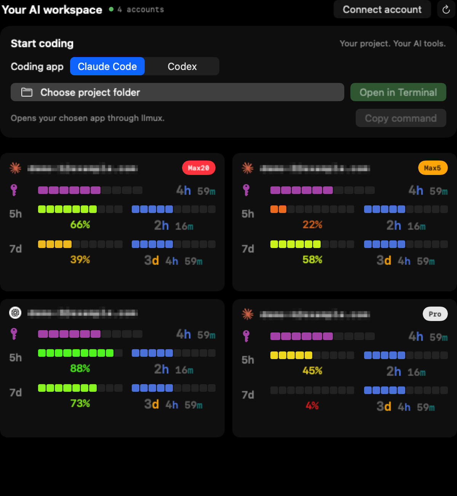

# llmux

**Several Claude subscriptions. How much is left, at a glance.**

Then let Claude, GPT and Grok work in the same Claude Code session.

<p align="center">
  <a href="#start-with-islands">islands</a> · <a href="#claude-implements-gpt-reviews--inside-the-same-claude-code">claude + gpt</a> · <a href="#see-what-was-actually-sent-to-the-model">raw traffic</a> · <a href="#install">install</a> · <a href="docs/README.md">docs</a>
</p>

---



<sub>Real app UI with demo data, built from the Islands get-started source (PR #196, preview channel). Captured 2026-10-08.</sub>

llmux Islands is a native macOS menu-bar and notch companion (with a KDE/Qt port). It shows every connected account, how much of its 5-hour and 7-day windows is left, and when each window resets. Underneath is llmux: a local proxy on `localhost:3456` that holds your accounts and routes each request by model name. Claude Code and Codex CLI talk to llmux instead of the provider, so one session can reach Claude, Codex (GPT), Grok and OpenRouter accounts.

## Start with Islands

```bash
brew install --cask 2lab-ai/tap/llmux-islands   # installs the app and the llmux CLI (stable 0.2.25)
```

1. Open **llmux Islands**.
2. Choose **Connect your first account** and sign in. Repeat for each subscription.
3. See the remaining usage and reset time for each account.

Optional: under **Start coding**, pick Claude Code or Codex, choose a project folder, then **Open in Terminal** (or **Copy command**).

Guide: [llmux Islands](docs/llmux-islands.md).

The first-run screens and the Start coding launcher ship on stable since v0.2.25 (2026-10-08). Already on 0.2.24? Run `llmux update`; the app and the CLI must come from the same release ([release availability](docs/operational-reference.md#release-availability)).

## Claude implements, GPT reviews — inside the same Claude Code

Claude Code can delegate to custom agents, and a custom agent accepts a full model ID in its `model:` field ([Claude Code docs: choose a model](https://code.claude.com/docs/en/sub-agents#choose-a-model)). llmux routes that ID by name. Point an agent at a GPT model and its requests go to your Codex (ChatGPT) account while the parent session stays on Claude.

Add a Codex account:

```bash
llmux login --codex
```

Add `.claude/agents/gpt-reviewer.md` to your project:

```markdown
---
name: gpt-reviewer
description: Independent code reviewer running on GPT. Use for a second-opinion review of a file or diff.
model: gpt-6-astra[1m]
tools: Read
---
Read the file you are given, list concrete defects with line numbers, and end with
one line: VERDICT: <APPROVE|REQUEST_CHANGES>.
```

Start Claude Code through llmux:

```bash
llmux run -- --model fable
```

Then ask, for example:

```text
Have gpt-reviewer review sample.py, then summarize what it found.
```

Receipt from 2026-10-08 (llmux preview 2026-10-08-0306). That run also defined the Grok reviewer from the next section, so the parent's final text names both agents. Verbatim from its first reviewer heading to the end (the opening lines before that heading are omitted):

```markdown
**gpt-reviewer**
```
MODEL: gpt-6-astra[1m] (as identified by the runtime instructions)
VERDICT: REQUEST_CHANGES
```

**grok-reviewer**
```
MODEL: grok-4.7
VERDICT: REQUEST CHANGES — empty-input crashes and a silent wrong-user fallback make both functions unsafe to call as written.
```

**Shared findings.** Both reviewers flagged the same three defects: `average` divides by zero on empty input, `find_user` silently returns the first user when no name matches, and `find_user` raises IndexError on an empty list.

**Found only by grok-reviewer**
- Line 9: `u["name"]` assumes every element is a mapping with a `"name"` key. A missing key raises KeyError and a non-mapping element raises TypeError, aborting the search before later matches are considered.

**Found only by gpt-reviewer**
- None.

PARENT MODEL: claude-fable-5-1[1m]
```

In the Activity feed the review is a `subagent` row: model `gpt-6-astra`, group `codex`, served by your Codex account, HTTP 200. The parent turns stay in group `claude`. Claude Code prints an `unrecognized_model` warning for IDs it does not know, then sends the request anyway.

Details: [multi-model agents](docs/multi-model-agents.md).

## Add Grok: three models review the same change

```bash
llmux login --grok
```

Add `.claude/agents/grok-reviewer.md` with the same body as `gpt-reviewer`:

```markdown
---
name: grok-reviewer
description: Independent code reviewer running on Grok. Use for a third-opinion review of a file or diff.
model: grok-4.7
tools: Read
---
```

Ask Claude to send the same change to both reviewers and collect where they disagree. Claude writes the code, GPT and Grok review it, and the disagreements tell you where to look. In the receipt above, only `grok-reviewer` flagged the unguarded `u["name"]` lookup on line 9. Its request appeared as a `subagent` row with model `grok-4.7`, group `grok`, served by a Grok account.

This is project configuration (two agent files and a prompt), not a bundled llmux command.

## What makes it work

- **Account choice before reset.** Within one provider group, an account must pass eligibility gates first (auth, pause, 429 cooldown, 5h ≤ 0.90, 7d ≤ 0.99, fresh usage). The `default` mode then scores servable headroom × urgency (urgency rises up to 4× as the 7-day reset nears) and switches only when another account scores more than 25% higher, so it prefers quota that would otherwise expire unused. `round-robin` never switches proactively. [Schedulers](docs/schedulers.md).
- **Keep your harness, change the model.** Claude Code keeps its own tools, permissions and project conventions. `/model fable`, `/model gpt-6-astra[1m]` or `/model grok-4.7` selects the backend. [Why llmux exists](docs/why-llmux.md).
- **Codex CLI too.** `llmux run --codex` launches Codex against the same account pool and routing. Claude models on that path need Node.js 18+ and npm on the daemon host. llmux does not synchronize settings, hooks or skills between Claude Code and Codex. [Codex frontend](docs/codex-frontend/README.md).
- **One daemon for several computers (optional).** Manage accounts on one computer and connect other computers over a trusted overlay such as Tailscale or WireGuard. Issued per-computer keys attribute usage to each computer. The CLI uses plain HTTP; the Islands app requires HTTPS for non-loopback endpoints. [Remote daemon](docs/remote.md).

## See what was actually sent to the model

Did the field I set reach the model? Which leg returned the error? What did the provider say before translation?

For a translated Codex or Grok exchange the raw request viewer records four legs: the client request, the rewritten upstream request, the verbatim upstream response, and the response delivered to the client. A byte-identical Claude passthrough shows two. You can copy a request as curl with credentials redacted; bodies may still contain prompts. For Claude through Codex, the upstream legs record the SDK bridge transport, not private Anthropic HTTP.

Guide: [the accidental AI debugger](docs/ai-debugger.md).

## Install

| You want | Command | Channel |
| --- | --- | --- |
| Islands app + CLI | `brew install --cask 2lab-ai/tap/llmux-islands` | stable (0.2.25, 2026-10-08) |
| CLI only | `brew install 2lab-ai/tap/llmux` | stable (0.2.25, 2026-10-08) |
| Rolling preview (CLI, or `--cask 2lab-ai/tap/llmux-islands-preview` for the app) | `brew install 2lab-ai/tap/llmux-preview` | preview |
| Build from source | `git clone https://github.com/2lab-ai/llmux && cd llmux && just build` | your checkout |

Each Islands cask depends on its channel's formula, and the two casks conflict. Switch an existing install with `llmux channel preview` or `llmux channel stable`; the switch is mirrored onto the Islands cask. What ships on which channel: [release availability](docs/operational-reference.md#release-availability). The KDE port of Islands is a [source build](llmux-islands-linux/README.md). `just build` runs `cargo build --release --locked`.

From the terminal:

```bash
llmux login               # Claude subscription OAuth; repeat once per account
llmux login --api         # optional: Anthropic API key
llmux login --codex       # optional: Codex / ChatGPT subscription
llmux login --grok        # optional: Grok / xAI (device-code flow)
llmux login --openrouter  # optional: OpenRouter (browser PKCE; --paste for an existing key)
llmux import              # or import supported local credential stores

llmux run                 # starts/reuses the daemon, then launches claude; args after -- pass through
llmux run --codex         # same daemon, Codex CLI (install Codex on the client)
llmux server              # foreground TUI dashboard
```

In the dashboard, `n` opens a provider picker for the same four browser logins. Manual shell wiring also works: `eval "$(llmux env)"`, then `claude`. `llmux env --codex` prints OpenAI-compatible exports; see the [manual setup](docs/operational-reference.md#running-codex-through-llmux).

## Switching models

The incoming model name selects the backend in either client. For example, inside Claude Code:

```text
/model fable
/model opus[1m]
/model gpt-6-astra[1m]
/model grok-4.7
/model or-ox-alpha
```

| Name pattern | Backend group |
| --- | --- |
| Claude-like (`fable`, `opus`, `sonnet`, `haiku`, `claude-*`) | Claude accounts |
| `gpt-*` / `codex` / aliases (`sol`, `terra`, `luna`) | Codex accounts |
| `grok` / `grok-*` | Grok accounts |
| `or` / `or-*` / `openrouter/*` | OpenRouter accounts |

Catalog on 2026-10-08 (`GET /models`): `claude-fable-5-1[1m]` (fable), `claude-opus-5-5[1m]` (opus), `claude-sonnet-5-5[1m]` (sonnet), `claude-haiku-5-5[1m]` (haiku, preview), `gpt-6.1-sol` (sol), `gpt-6-astra[1m]` (astra), `gpt-6-luna` (luna), `gpt-5.6-sol`, `gpt-5.6-terra` (terra), `gpt-5.5`, `grok-4.7` (grok), `grok-4.6`, `grok-4.5`, `or-ox-alpha` (or).

Inside a `llmux run` session `/model` lists the llmux [catalog](docs/models.md#claude-code-model-picker) — every codex/grok/openrouter id too, not just the built-in Claude rows. The same launch exports `ANTHROPIC_DEFAULT_{OPUS,FABLE,SONNET,HAIKU}_MODEL` from the catalog's alias owners, so `/model opus` — which Claude Code resolves natively, before llmux ever sees it — lands on `claude-opus-5-5[1m]` and its 1M window instead of the client's 200k default ([alias exports](docs/models.md#alias-exports); a var you already export is left alone). `--no-model-picker` opts out of both.

`haiku` now selects Haiku 5.5 (published 1M context); the explicit `claude-haiku-4-5` ID stays available. Cost displays use reference rates and do not account for Haiku 5.5’s higher >100K-prompt tier or 1h cache writes ([model and pricing notes](docs/models.md#model-sweep-2026-10-08)).

Curated catalog (ids, aliases, efforts, context windows): `GET /models` and [docs/models.md](docs/models.md). Routing config: [docs/configuration.md](docs/configuration.md).

> **Same request, different backend — read [provider compatibility](docs/provider-compatibility.md) before you trust a field.** The following caveats describe **incoming Anthropic Messages**: Claude and OpenRouter use native Messages, while Codex and Grok require translation. Incoming **OpenAI Responses** uses native Codex Responses or the Claude Agent SDK, with different controls; see the [frontend transport matrix](docs/provider-compatibility.md#frontend-transport-matrix).
>
> - **`gpt-*` (Codex): no output-limit guarantee — your `max_tokens` is not sent upstream at all.** The gateway answered `400 Unsupported parameter: max_output_tokens` (live probe 2026-09-14), and no supported alternative cap field **was found** in the current official Codex client or its docs (read 2026-09-14), so llmux omits the cap rather than faking one. That is a search result, not an allowlist: other field names are untested, not proven absent.
> - **`grok-*`: the cap is forwarded, but it is not the budget you asked for.** A `max_output_tokens: 1` probe (2026-09-14) came back `incomplete` with one visible token and 168 reported output tokens, 167 of them reasoning. What it bounds in general — and what it costs — is unmeasured.
> - **Both:** non-null `temperature` / `top_p` / `top_k` and **non-empty** `stop_sequences` are refused with a local 400 (except [scoped monitor/title adapters](docs/provider-compatibility.md#claude-code-internal-tasks)), prior `thinking` blocks are dropped, and there is no reasoning continuity across turns.
> - **Claude Code auto mode:** after an observed GPT main turn, the same session's safety monitor defaults to `luna` with medium effort. Both severity stages are supported; unknown sessions keep normal routing. This changes the reviewer model, not the requested safety policy.
> - **Claude Code internal models:** in GPT sessions, implicit Opus/Sonnet/Haiku requests use configurable `sol`/`terra`/`luna` aliases. Titles preserve their JSON schema; initial titles and quota use proven launch context before the first main turn. Quota checks Codex availability without inventing Claude quota percentages. Explicit main Claude switches remain authoritative. [Configuration](docs/configuration.md#claude-code-internal-models-claude_code).
>
> A translated response that lost something names it in `X-Llmux-Omitted-Fields` / `X-Llmux-Compatibility-Warnings` (a faithful one carries neither header); send `X-Llmux-Compatibility: strict` to turn any such loss into a 400 instead. Full matrix, receipts and known unknowns: [docs/provider-compatibility.md](docs/provider-compatibility.md).

## Update

```bash
llmux channel            # print the current channel (stable | preview)
llmux update             # upgrade in place; restarts the daemon only if the binary changed
llmux channel preview    # switch channels (mirrored onto the llmux-islands cask)
```

Details: [channels and updating](docs/operational-reference.md#channels-and-updating).

## Docs

- [llmux Islands](docs/llmux-islands.md) — macOS menu-bar/notch companion
- [multi-model agents](docs/multi-model-agents.md) — Claude Code custom agents on GPT and Grok models, with a live receipt
- [the accidental AI debugger](docs/ai-debugger.md) — per-request receipts, raw request/response viewer, copy-as-curl, email masking
- [docs index](docs/README.md) — map of all guides
- [why llmux exists](docs/why-llmux.md) — the harness-is-capital bet
- [what ships today](docs/features.md) — the complete feature list
- [remote daemon](docs/remote.md) — one central daemon, remote-mode command matrix, transport security
- [schedulers](docs/schedulers.md) — eligibility gates, `default` vs `round-robin`, adding a mode
- [operational reference](docs/operational-reference.md) — commands, TUI keys, daemon/dashboard, release availability, per-computer client keys
- [Codex frontend](docs/codex-frontend/README.md) — launch, SDK requirements, tools, HTTP and endpoint activity
- [configuration](docs/configuration.md) — config keys, proxy/scheduler/routing, account types
- [models](docs/models.md) — catalog, aliases, context windows, group routing
- [provider compatibility](docs/provider-compatibility.md) — per-backend difference matrix: dropped/refused request fields, `max_tokens` on Codex/Grok, diagnostic headers
- [FAQ](docs/faq.md) — seeing what is left per account, subagents on GPT or Grok, what needs preview, context-window workarounds
- [system prompts (multi-model)](docs/system-prompts/README.md) — real captured wire system prompts

## Compliance & caveats

llmux is for **one human using their own accounts** — no credential pooling, no resale.

- **Durable path:** keep your chosen client harness; Claude through Claude Code/subscription or Anthropic API keys; other models through supported API keys.
- **Convenience path:** routing third-party flat-rate subscription tokens through a different client depends on that vendor's current policy and can change without notice. Use it opt-in, with your own accounts only, and keep an API-key fallback configured.
- Anthropic quota headers and vendor subscription-token behavior may change.
- llmux is not affiliated with Anthropic, OpenAI, xAI, or OpenRouter.

Product intent — what llmux is, what it bets on, and what it refuses — is fixed in [`.prd/`](.prd/).

## Agent instructions

If you are an AI agent working on this repository, read [`AGENTS.md`](AGENTS.md) before making changes.

## License

MIT.
