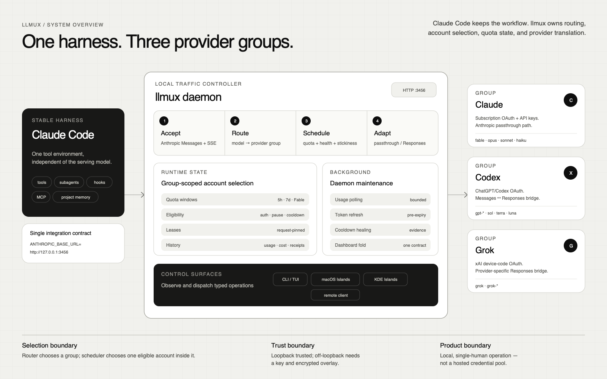

# llmux documentation

Start with the product-level [README](../README.md). This index is the next
layer: choose the shortest path for what you are trying to do, then descend
into reference or implementation evidence only when needed.

## New to llmux

Read these in order:

1. [Getting started](getting-started.md) — install the CLI, add an account,
   send the first request, and verify the daemon.
2. [How llmux works](concepts.md) — understand the harness, router, scheduler,
   account pools, and control surfaces.
3. [Architecture](architecture.md) — follow the runtime and data flows in more
   detail.

## Choose a task

| I want to… | Open |
| --- | --- |
| See every command and TUI key | [Operational reference](operational-reference.md) |
| Tune routing, quotas, privacy, remote mode, or request shaping | [Configuration](configuration.md) |
| Understand or change account selection | [Scheduling guide](guides/scheduling.md) |
| Run one daemon from another machine | [Remote daemon guide](guides/remote-daemon.md) |
| Choose a Claude, Codex, or Grok model | [Model catalog](models.md) |
| Install or use the native macOS/KDE UI | [llmux Islands](llmux-islands.md) |
| Fix a common problem | [FAQ](faq.md) |

## Native clients

- [llmux Islands user guide](llmux-islands.md) — shared behavior, macOS cask,
  Arch `PKGBUILD`, privacy, remote mode, and real screenshots.
- [macOS component README](../llmux-islands/README.md) — source layout, Xcode
  build, bridge boundary, and daemon API usage.
- [Linux component README](../llmux-islands-linux/README.md) — Arch package,
  KDE platform mapping, source build, and maintainer verification.
- [Shared-core ABI](../llmux-islands-macos-bridge/ABI.md) — versioned C bridge
  contract for maintainers.

## Deep reference and evidence

- [System-prompt captures](system-prompts/README.md) — dated, real wire
  captures used to compare Claude Code behavior across model families.
- [Grok provider STV](grok/spec.md) and [trace](grok/trace.md) — implementation
  design and vertical evidence, not an end-user setup guide.
- [Decision archive](../.prd/README.md) — current product contracts, shipped
  decisions, research, historical component plans, and completed convergence
  logs.
- [Contributor guide](../AGENTS.md) — architecture and development rules.
- [Documentation ownership](../rules/documents.md) — the file that must change
  with each user-visible behavior.

## How this documentation is organized

- **Front page** explains the product and gets a new user to a first request.
- **Guides** are task-oriented and contain opinionated sequences.
- **References** enumerate stable commands, keys, models, and API behavior.
- **Decision records** explain why a design exists and may preserve historical
  context; they are not installation instructions.
- **Evidence** records dated observations, captures, traces, and visual
  receipts. Treat its timestamp and provenance as part of the claim.

When a guide and a decision record differ about shipped behavior, the current
code plus the owning user guide wins; update the decision index to make the
supersession explicit.
