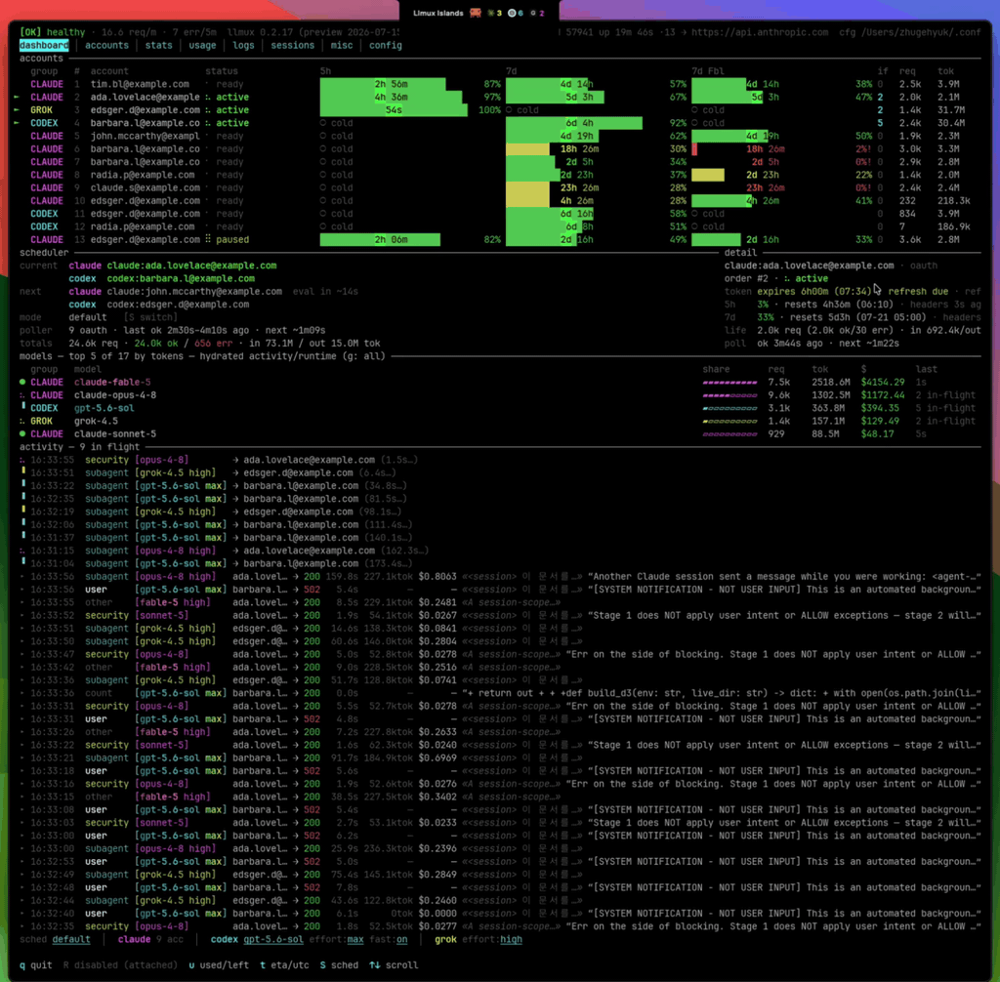
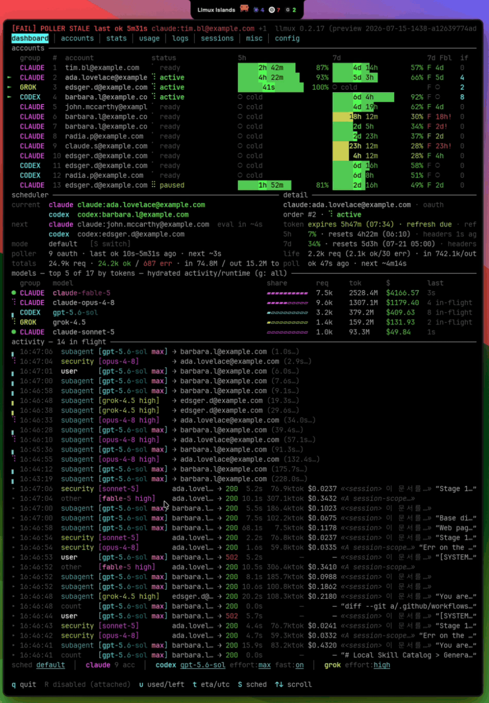

# See what was actually sent to the model.

This page answers three questions:

- Did the field I set (`max_tokens`, `thinking`, `tools`) actually reach the
  provider, or did the adapter drop it?
- Which leg returned the error — the client request, llmux's rewrite, the
  provider, or the response conversion?
- What did the provider really return before llmux translated it?

Every model request your agent makes flows through `localhost:3456`, and llmux
records each exchange at its transport boundaries, so the dashboard doubles as
DevTools for your agent's model traffic.

## Open it

Run `llmux dashboard` (or the foreground `llmux server`), expand a row in the
Activity feed, and choose `🔍 request`. The raw viewer opens as a modal over the
dashboard.

- A translated Codex or Grok exchange shows four legs: `Request` (what the client
  sent) → `Upstream Req` (what llmux rewrote it into) → `Upstream Resp` (the
  provider's verbatim reply) → `Response` (what your client received).
- A byte-identical Claude passthrough shows two legs.
- `C` copies the selected HTTP leg as a `curl` command. Credential values stay
  `•••redacted`; substitute your own before replaying.
- `S` saves the whole record JSON to `~/Downloads`.

Viewer key reference: [operational-reference.md](operational-reference.md#raw-requestresponse-viewer).

[Original raw-viewer recording (mp4)](../screenshots/llmux-raw-viewer-demo.mp4) — captured 2026-07-16.

## Multi-model sessions

When Claude Code delegates to agents on other models (see
[multi-model-agents.md](multi-model-agents.md)), each agent's request is its own
Activity row, with kind `subagent`, the served account, and the backend group.
Open that row to see exactly what the GPT or Grok worker received — including the
system prompt Claude Code injected — and compare it with the parent's request.
Claude through Codex still stops at the SDK transport boundary described below.

## What it records

- **Live per-request receipts.** The activity feed prints one row per completed
  request: what it was (`user` turn, `subagent`, `security` pass, `compact`,
  `count`, …), model + effort, serving account, status, latency, tokens,
  API-equivalent cost, and a session-tagged input preview. "Which subagent just
  burned 236k tokens on that turn" has a one-glance answer.
- **A DevTools-style raw viewer.** Open any request (`🔍 request` on an expanded
  row) into a modal over the dashboard and walk the legs listed above. Headers,
  SSE events, rate-limit state, request bodies: scroll, pan, and read the actual
  bytes.
- **SDK transport boundary.** For Claude through Codex, the client legs preserve
  Responses while the upstream legs labeled `claude-agent-sdk` contain the Messages
  bridge transport. They do not expose the SDK’s private Anthropic HTTP request
  and cannot be replayed as a vendor curl. Capture defaults to enabled and can be
  disabled with `raw_io.enabled`.
- **Copy as curl.** For HTTP legs, one keypress reconstructs a `curl` for that side of the
  exchange — credential values stay `•••redacted`, so substitute your own before
  replaying. Raw bodies copy to the clipboard, and `save all` writes the whole
  record JSON to `~/Downloads`. A provider bug report with the exact failing frame
  attached is one keypress away.
- **Wire truth, archived.** Captures persist to `raw-io.jsonl`, and the repo's
  [captured system prompts](system-prompts/) were taken from this same wire —
  what Claude Code actually injects per model, not what the docs say it injects.
- **Email masking for screen shares.** `email_anonymous` masks every account email
  behind a fixed pool of famous-CS-name fakes across the TUI and Islands, and
  credential header values (`authorization`, keys/tokens/cookies) are redacted at
  capture time. Raw payloads still contain whatever your session contained — treat
  the viewer's body panes accordingly. The recordings on this page were taken live
  with masking on, with remaining identifiers pixelated in post.

[Original usage-tab recording (mp4)](../screenshots/llmux-usage-raw-demo.mp4) — captured 2026-07-16.

The kinds of questions this answers in seconds, because the evidence is already on
screen: why is this request 428 KB; did `context_management` edits actually apply
upstream; what did the provider really return before the adapter converted it;
which account is about to hit its 5-hour window, and why did the scheduler switch.
Debugging an agent stack without seeing the wire is guesswork — this makes the wire
a first-class surface.
