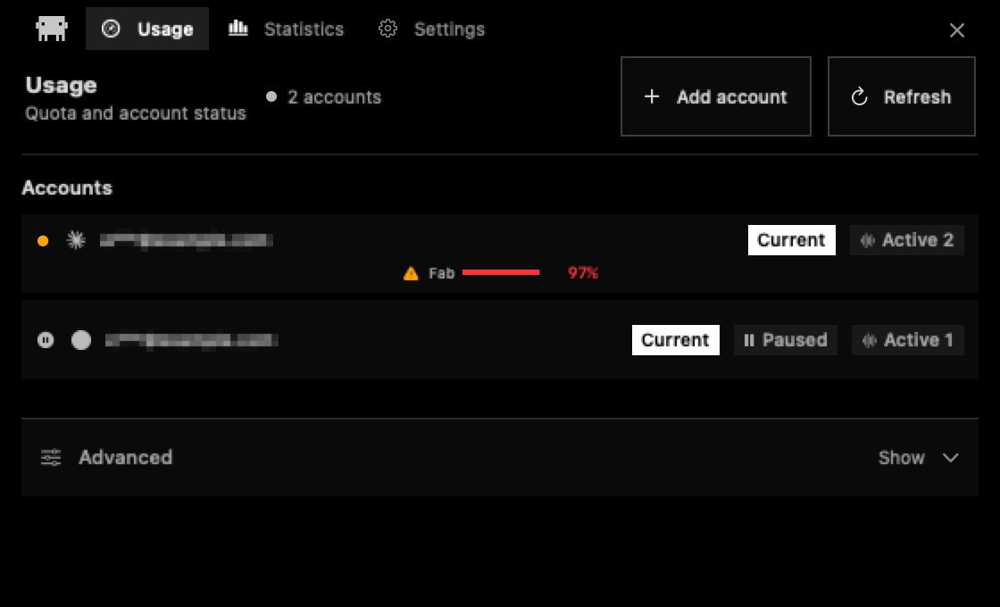
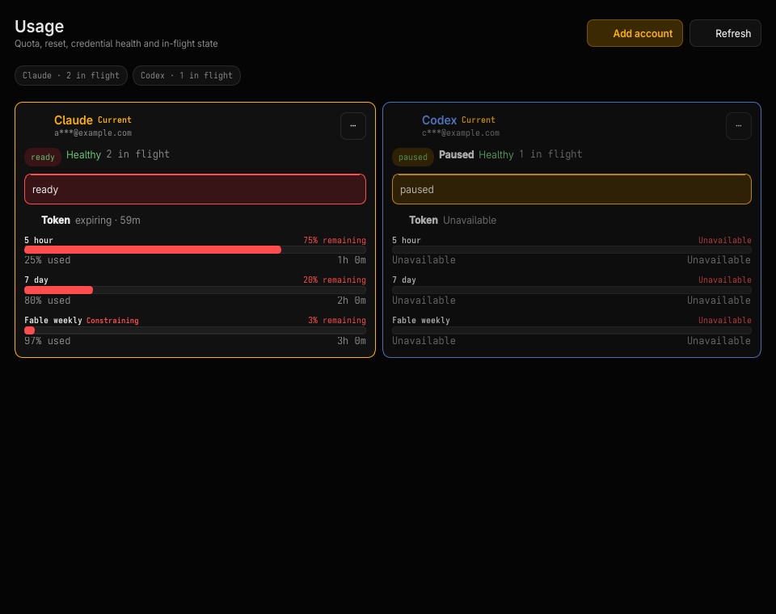
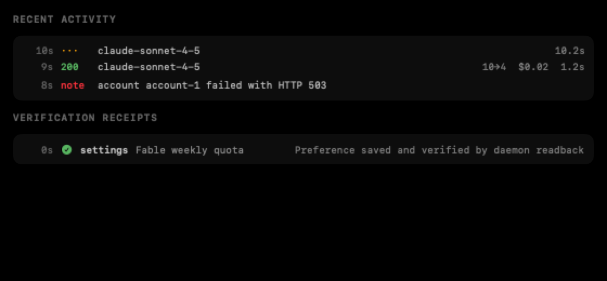
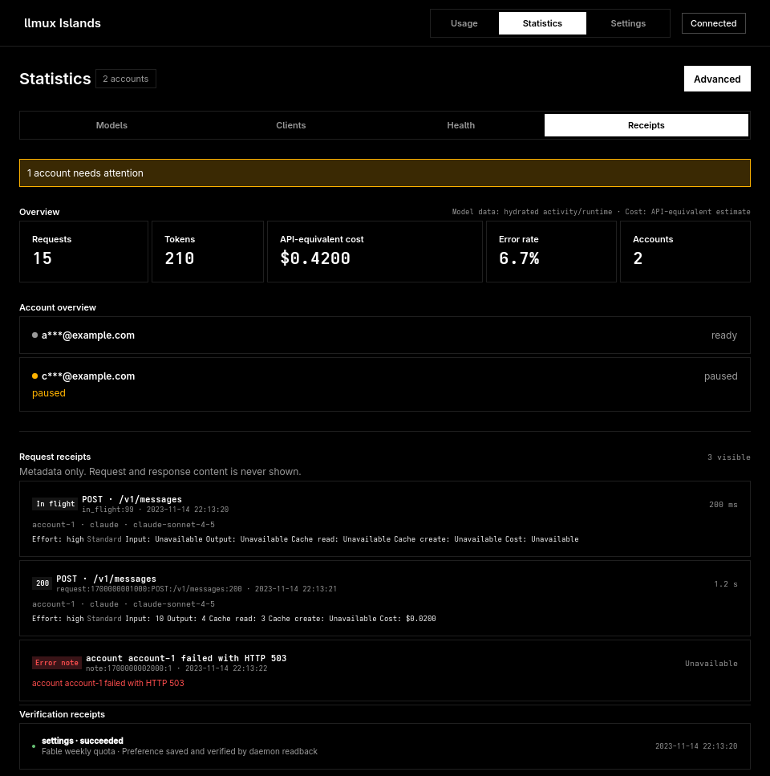

# llmux Islands

llmux Islands is the native companion UI for the llmux daemon. It ships as a
SwiftUI/AppKit notch app on macOS and as a Qt 6/QML/Kirigami shell on Arch
Linux/KDE. Both clients consume the same Rust semantic state, privacy rules,
typed actions, and verification receipts while keeping platform-native window,
tray, sound, and notification behavior.

The daemon remains the source of truth. Islands does not read
`~/.config/llmux.json`, own provider credentials, or run separate quota
scripts.

## At a glance

| Capability | macOS | Arch Linux/KDE |
| --- | --- | --- |
| Primary surface | notch/floating island | Plasma layer-shell island where available, tray + native window fallback elsewhere |
| Install | Homebrew cask | repository `PKGBUILD` (`llmux-islands-git`) |
| Stable/preview package | `llmux-islands`, `llmux-islands-preview` | not yet published to pacman, AUR, xbrew, or GitHub Releases |
| Shared state/actions | Rust core through C ABI | Rust core through CXX-Qt |
| Remote policy | loopback HTTP; remote HTTPS + API key; redirects denied | same |

## What it shows and controls

- Claude, Codex, and Grok activity counters in the compact surface.
- Per-account health, 5-hour/7-day/Fable windows, reset timing, and pauses.
- Model, token, cost, client, and calendar statistics from the daemon history.
- Recent request and settings verification receipts without request bodies or
  secrets.
- Account add/remove, OAuth orchestration, pause/resume, scheduler and provider
  settings, events, refresh, and daemon maintenance actions.
- Email-anonymous and deterministic demo modes for screen sharing.

On the macOS notch, the compact activity indicator hides a provider whose
in-flight count is zero. Active counts animate, and the mascot's motion scales
with activity up to a bounded maximum. KDE presents the same provider counts
and health through its compact text summary and tray surfaces without copying
that notch-specific animation.

## Before launching

Install and configure the `llmux` CLI first, then verify the daemon:

```bash
llmux status || llmux restart
```

For a first installation, follow [Getting started](getting-started.md). Both
native clients may start a missing local daemon when the selected endpoint is
loopback and an installed `llmux` binary is available. They never start a
daemon for a remote endpoint.

## macOS

### Install

Stable:

```bash
brew install 2lab-ai/tap/llmux-islands
```

Preview:

```bash
brew install 2lab-ai/tap/llmux-islands-preview
```

Launch `LlmuxIslands.app` from Applications, Spotlight, or Finder. Click or
hover over the notch to open the island; click it again or click outside to
close it. The app intentionally does not create a separate menu-bar status
item.

Source layout and Xcode build commands live in the
[macOS component README](../llmux-islands/README.md).

## Arch Linux / KDE

There is currently no AUR, pacman repository, xbrew recipe, or Linux GUI
release asset for Islands. These therefore fail by design today:

```text
xbrew install llmux-islands
xbrew install llmux-islands-preview
```

Install the repository package instead:

```bash
sudo pacman -S --needed base-devel git
git clone --depth=1 https://github.com/2lab-ai/llmux.git
cd llmux/llmux-islands-linux/packaging/arch
CARGO_BUILD_JOBS=2 MAKEFLAGS=-j2 makepkg -si
```

This builds and installs package `llmux-islands-git`, which provides
`llmux-islands` and installs the executable as:

```bash
llmux-islands-linux
```

The job limits cap local compile parallelism at two. The package also installs
the desktop entry, AppStream metadata, icon, and license. It never invokes
`sudo`, pacman, or an AUR helper from inside the app.

On Plasma Wayland the app uses LayerShellQt for the compact top surface. Other
Wayland desktops use a regular-window fallback; X11 uses a frameless top-center
tool window. The tray uses Qt's StatusNotifierItem integration on Plasma.

Configuration is stored at `$XDG_CONFIG_HOME/llmux/islands.json` or
`~/.config/llmux/islands.json`, with private directory/file permissions. For
source builds, dependencies, platform mapping, and maintainer verification,
see the [Linux component README](../llmux-islands-linux/README.md).

## Visual tour

These are real deterministic renders produced by the macOS and clean-Arch CI
jobs from the same privacy-masked fixture. They are not mockups.

| macOS | KDE |
| --- | --- |
|  |  |
| Native usage mosaic and account tiles | Monochrome default surface with secondary controls collapsed |

Request and settings outcomes remain inspectable as privacy-safe receipts:

| macOS receipt | KDE receipt |
| --- | --- |
|  |  |

The complete 11-image gallery, dimensions, SHA-256 hashes, source commit, and
CI provenance are in the
[visual-receipts ledger](../.prd/docs/llmux-islands-linux-port/visual-receipts/README.md).

## Presentation boundaries

The platforms share meaning, not a widget tree.

- macOS preserves its native colored quota mosaic, rounded account tiles,
  statistics hierarchy, and notch interaction.
- KDE uses a monochrome shell, square aligned controls, equal-width data grids,
  and a local **Advanced** disclosure for infrequent detail and operations.
- Offline, authentication, warning, failure, and destructive-confirmation
  states are never hidden under Advanced.
- Opening Advanced changes presentation only; it does not dispatch a daemon
  action or persist state.

The design and cross-platform mapping are documented in the
[Linux port dossier](../.prd/docs/llmux-islands-linux-port/README.md).

## Privacy

### Email anonymous

Enable **Email anonymous** while showing real live usage on a recording or
screen share. The daemon/TUI uses stable aliases; Islands projects opaque
account handles and renders email regions unreadably while retaining layout.
API documents continue to carry real account names for authorized clients.

### Demo mode

Demo mode replaces live identities with deterministic fake data and suppresses
config writes. On macOS:

```bash
open -na /path/to/LlmuxIslands.app --args --demo
```

or:

```bash
LLMUX_ISLANDS_DEMO=1 \
LLMUX_ISLANDS_DEMO_INFLIGHT="claude=3,codex=2,grok=1" \
open -na /path/to/LlmuxIslands.app
```

The Linux snapshot mode is a developer/evidence tool and never contacts a
live daemon; see the component README rather than using it as normal startup.

## Remote daemon

Loopback HTTP is allowed and does not send a configured remote key. A remote
Islands endpoint must use HTTPS and an `x-api-key`; redirects are denied. The
stored control credential remains in native connection settings and is never
projected back into QML/SwiftUI semantic state.

Use a trusted overlay or TLS-terminating endpoint and follow the
[remote daemon guide](guides/remote-daemon.md). The app never starts or stops a
daemon on another machine.

## Troubleshooting

### The app says llmux is unavailable

```bash
llmux restart
llmux status
```

For a remote connection, confirm HTTPS, host/port reachability, and that the
app key matches the daemon's `proxy.api_key`.

### `xbrew` cannot install Islands on Arch

That is expected until a Linux package recipe is published. Use the repository
`PKGBUILD` under [Arch Linux / KDE](#arch-linux-kde).

### The macOS build has no Xcode project

The project is generated and gitignored:

```bash
cd llmux-islands
xcodegen generate
```

### Screen capture is black or incomplete

Grant Screen Recording permission to the terminal that starts the recorder,
restart that terminal, and capture again.
